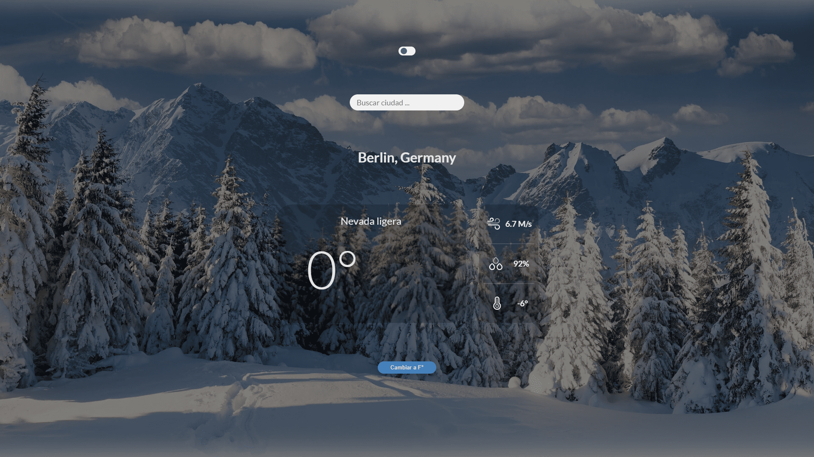

# Weather App with React and Vite

This project is a web application that displays weather information using React and Vite as its main tools. It provides an interactive interface to showcase current weather data based on the user's location or a specific city search.

## Features

- **React and Vite:** The project uses React as a library for the user interface and Vite as the development tool.
- **OpenWeatherMap API:** Integrates with the [OpenWeatherMap API](https://openweathermap.org/api) to fetch updated weather data.
- **ISO API:** Utilizes an ISO API to retrieve full country names.
- **City Search:** Implements a search bar that allows users to search for weather data by city name.
- **Error Handling:** Displays an error notification when there's an issue fetching data from the API.
- **Responsive Interface:** The application provides an adaptable interface that displays relevant weather data legibly.
- **Dark Mode:** Includes a dark mode function that adapts the interface based on the time of day.

## Folder Structure
- **/src:** Contains the source files of the React application.
- **/public:** Holds static files such as images and the application icon.
- **/styles:** CSS files and styles for the application.

## Usage
The application automatically displays current weather information based on the user's location. It also provides the option to search for weather conditions in a specific city using the search bar.

## Application Logic
- **API Data Retrieval:** Utilizes the OpenWeatherMap API to fetch weather data based on location or city search.
- **Error Handling:** Displays a notification in case of an error while fetching data from the API.
- **Search Logic:** Implements the logic to search for weather data based on city name.
- **Interactive Interface:** Provides a user-friendly interface with a unit change button and temperature display options.

## Contribution
If you wish to contribute to the project, feel free to fork and send your Pull Requests. Any improvements or suggestions are welcome.

## Authors
- Jesús Aguilar - [GitHub Profile](https://github.com/JesusAguilarAliaga) - Lead Developer

## Español
Este proyecto es una aplicación web que muestra información meteorológica utilizando React y Vite como herramientas principales. Proporciona una interfaz interactiva para mostrar datos meteorológicos actuales basados en la ubicación del usuario o una búsqueda específica de la ciudad.

## Características

- **React y Vite:** El proyecto utiliza React como biblioteca para la interfaz de usuario y Vite como herramienta de desarrollo.
- **API de OpenWeatherMap:** Se integra con la [API de OpenWeatherMap](https://openweathermap.org/api) para obtener datos meteorológicos actualizados.
- **API de ISO:** Utiliza una API de ISO para obtener los nombres completos de los países.
- **Búsqueda por Ciudad:** Implementa un buscador que permite buscar datos meteorológicos por nombre de ciudad.
- **Manejo de Errores:** Muestra una notificación de error cuando ocurre un problema al obtener datos de la API.
- **Interfaz Responsiva:** La aplicación proporciona una interfaz adaptable que muestra datos meteorológicos relevantes de manera legible.
- **Modo Oscuro:** Incluye una función de modo oscuro que adapta la interfaz según el tiempo del día.

## Estructura de Carpetas
- **/src:** Contiene los archivos fuente de la aplicación React.
- **/public:** Contiene archivos estáticos, como imágenes y el ícono de la aplicación.
- **/styles:** Archivos CSS y estilos para la aplicación.

## Uso
La aplicación muestra la información meteorológica actual automáticamente basada en la ubicación del usuario. También proporciona la opción de buscar el clima de una ciudad específica utilizando la barra de búsqueda.

## Lógica de la Aplicación
- **Obtención de Datos de la API:** Utiliza la API de OpenWeatherMap para obtener datos meteorológicos en función de la ubicación o la búsqueda de ciudad.
- **Manejo de Errores:** Muestra una notificación cuando ocurre un error al obtener datos de la API.
- **Lógica de Búsqueda:** Implementa la lógica para buscar datos meteorológicos por nombre de ciudad.
- **Interfaz Interactiva:** Proporciona una interfaz fácil de usar con un botón de cambio de unidades y opciones de visualización de temperatura.

## Contribución
Si deseas contribuir al proyecto, siéntete libre de hacer un fork y enviar tus Pull Requests. Cualquier mejora o sugerencia es bienvenida.

## Autores
- Jesús Aguilar - [Perfil de GitHub](https://github.com/JesusAguilarAliaga) - Desarrollador Principal

## License
This project is under the MIT License.